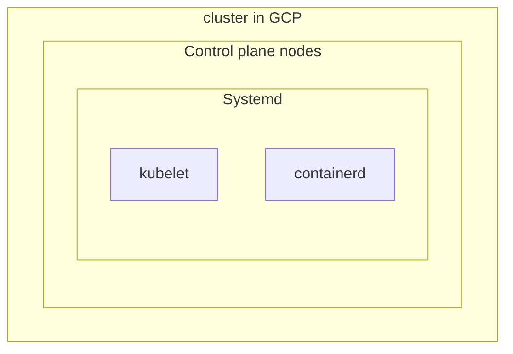

Follow [an official article](https://kubernetes.io/docs/setup/production-environment/tools/kubeadm/create-cluster-kubeadm/) for this document when the version of Kubernetes was 1.26 and set up VMs on GCP.

# Getting Started

In this document, the next kubernetes cluster will be set up:



- Control plane nodes are registered as k8s-control-plane.at-ishikawa.dev
- Pod cidr range is registered from the GCP subnt
- Systemd is used to manage cgroups
- containerd is used for container runtime


## Hardware requirements
- One or more machines running a deb/rpm-compatible Linux OS; for example: Ubuntu or CentOS.
- 2 GiB or more of RAM per machine--any less leaves little room for your apps.
- At least 2 CPUs on the machine that you use as a control-plane node.

## Set up

Set up 3 GCE instances using the instance template, instance group without autoscaling:

```bash
gcloud compute instance-templates create test-k8s-node-template --machine-type=e2-standard-4 --network-interface=network=default,network-tier=PREMIUM --maintenance-policy=MIGRATE --provisioning-model=STANDARD --scopes=https://www.googleapis.com/auth/cloud-platform --create-disk=auto-delete=yes,boot=yes,device-name=test-k8s-node-template,image=projects/debian-cloud/global/images/debian-11-bullseye-v20221206,mode=rw,size=100,type=pd-balanced --no-shielded-secure-boot --shielded-vtpm --shielded-integrity-monitoring --reservation-affinity=any
gcloud beta compute instance-groups managed create test-k8s-nodes --base-instance-name=test-k8s-nodes --size=3 --template=test-k8s-node-template --zone=us-central1-a --list-managed-instances-results=PAGELESS
gcloud beta compute instance-groups managed set-autoscaling test-k8s-nodes --project=$PROJECT --zone=us-central1-a --cool-down-period=60 --max-num-replicas=3 --min-num-replicas=3 --mode=off --target-cpu-utilization=1.0
```


## Set up a control plane node

### Check opened ports

See [this page](https://kubernetes.io/docs/reference/networking/ports-and-protocols/) for what ports are required to be opened.

Use netcat to check ports
```bash
sudo apt update && sudo apt -y install netcat
```

### Set up a bridge network

Follow [this document](https://kubernetes.io/docs/setup/production-environment/container-runtimes/) to set up container runtimes on the node.

Enable [overlay](https://docs.kernel.org/filesystems/overlayfs.html) and [br_netfilter](https://docs.microfocus.com/doc/Data_Center_Automation/2019.11/SetSystemParameters) kernel modules.

```bash
cat <<EOF | sudo tee /etc/modules-load.d/k8s.conf
overlay
br_netfilter
EOF

sudo /usr/sbin/modprobe overlay
sudo /usr/sbin/modprobe br_netfilter

# sysctl params required by setup, params persist across reboots
cat <<EOF | sudo tee /etc/sysctl.d/k8s.conf
net.bridge.bridge-nf-call-iptables  = 1
net.bridge.bridge-nf-call-ip6tables = 1
net.ipv4.ip_forward                 = 1
EOF

# Apply sysctl params without reboot
sudo sysctl --system
```

Verify the modules are loaded and running by:

```bash
lsmod | grep br_netfilter
lsmod | grep overlay
```

Verify configurations are set correctly by

```bash
sudo sysctl net.bridge.bridge-nf-call-iptables net.bridge.bridge-nf-call-ip6tables net.ipv4.ip_forward
```

### Install container runtime

In [this document](https://kubernetes.io/docs/setup/production-environment/container-runtimes/#containerd), I chose to install the `containerd` runtime.

To set up a containerd, see [another post](/2022/12/26/getting-started-containerd/) for more details.
After installing the containerd on the post, confirm the version of loopback CNI plugin should be greater than v1.0.
```
/opt/cni/bin/loopback --version
CNI loopback plugin v1.1.1
```

Then generate the default `container.toml` configuration

```bash
sudo mkdir /etc/containerd
sudo bash -c "containerd config default > /etc/containerd/container.toml"
```

Then edit the `container.toml`

```diff
        [plugins."io.containerd.grpc.v1.cri".containerd.runtimes.runc]
          ...
          [plugins."io.containerd.grpc.v1.cri".containerd.runtimes.runc.options]
-            SystemdCgroup = false
+            SystemdCgroup = true
```

Restart a containerd

```bash
sudo systemctl restart containerd
```


### Install kubelet, kubeadm, and kubectl

```bash
sudo apt update && sudo apt install -y apt-transport-https ca-certificates curl
sudo mkdir /etc/apt/keyrings
sudo curl -fsSLo /etc/apt/keyrings/kubernetes-archive-keyring.gpg https://packages.cloud.google.com/apt/doc/apt-key.gpg
echo "deb [signed-by=/etc/apt/keyrings/kubernetes-archive-keyring.gpg] https://apt.kubernetes.io/ kubernetes-xenial main" | sudo tee /etc/apt/sources.list.d/kubernetes.list
sudo apt update && sudo apt install -y kubelet kubeadm kubelet=1.25.5-00
```

Note that install kubelet 1.25 instead of 1.26 because I got an error described in [this article](https://serverfault.com/questions/1118051/failed-to-run-kubelet-validate-service-connection-cri-v1-runtime-api-is-not-im).


### Set up a cluster by kubeadm

Now, it's time to create a kubernetes cluster by

```bash
sudo kubeadm init
```

If it fails to init a k8s cluster, then fix an issue, revert a configuration by `kubeadm reset` and restart the init command again.


Then enable kubectl works for a non-root user by

```bash
mkdir -p $HOME/.kube
sudo cp -i /etc/kubernetes/admin.conf $HOME/.kube/config
sudo chown $(id -u):$(id -g) $HOME/.kube/config
```

#### Install a Networking addon

Install one of networking addons from [this list](https://kubernetes.io/docs/concepts/cluster-administration/addons/#networking-and-network-policy).

I chose cilium to install the networking addon.

At first, install helm by [this document](https://helm.sh/docs/intro/install/)

```bash
curl https://raw.githubusercontent.com/helm/helm/main/scripts/get-helm-3 | bash
```

Then install cilium by following [this document](https://docs.cilium.io/en/stable/gettingstarted/k8s-install-kubeadm/).

```bash
helm repo add cilium https://helm.cilium.io/
helm install cilium cilium/cilium --version 1.12.5 --namespace kube-system
```

Validate the installation of the cilium CLI.

First install the CLI by

```bash
CILIUM_CLI_VERSION=$(curl -s https://raw.githubusercontent.com/cilium/cilium-cli/master/stable.txt)
CLI_ARCH=amd64
if [ "$(uname -m)" = "aarch64" ]; then CLI_ARCH=arm64; fi
curl -L --fail --remote-name-all https://github.com/cilium/cilium-cli/releases/download/${CILIUM_CLI_VERSION}/cilium-linux-${CLI_ARCH}.tar.gz{,.sha256sum}
sha256sum --check cilium-linux-${CLI_ARCH}.tar.gz.sha256sum
sudo tar xzvfC cilium-linux-${CLI_ARCH}.tar.gz /usr/local/bin
rm cilium-linux-${CLI_ARCH}.tar.gz{,.sha256sum}
```

Then run these commands to validate if the cilium installation is correct
```bash
cilium status    --wait
cilium connectivity test
```

#### Cgroup drivers
There are 2 types of cgroup drivers
- systemd cgroup: If a `systemd` is used as the init system, then this should be used because systemd expects a single cgroup manager.
- cgroupfs

Note that systemd is recommended because kubeadm manages the kubelet as a systemd service.

To confirm if a cgroup driver is systemd, run
```bash
kubectl get cm kubelet-config  -n kube-system -o yaml | grep cgroupDriver
```


After setting up a control plane node, confirm a node and pods start working correctly.

If it's working correctly, the status of node should be Ready and
```
$ kubectl get nodes
NAME                  STATUS   ROLES           AGE     VERSION
test-k8s-nodes-cxgs   Ready    control-plane   3m21s   v1.25.5
```


### Troubleshooting

#### The node doesn't become Ready status
The node didn't become ready due to an error.

```bash
  Ready            False   Sat, 24 Dec 2022 05:34:14 +0000   Sat, 24 Dec 2022 05:34:08 +0000   KubeletNotReady              container runtime network not ready: NetworkReady=false reason:NetworkPluginNotReady message:Network plugin returns error: cni plugin not initialized
```

In my case, I just didn't install a CNI plugin of containerd and there was no file under `/etc/cni/net.d`


#### CoreDNS pods doesn't start

```bash
kubectl describe pods -n kube-system coredns-787d4945fb-qdl42
  Warning  FailedCreatePodSandBox  7s    kubelet            Failed to create pod sandbox: rpc error: code = Unknown desc = failed to setup network for sandbox "ff4f7fd11035c73bfe145563ad312e423d2dee5c86eb2db288e1dc261bf84e53": failed to find plugin "loopback" in path [/usr/lib/cni]
```

The loopback version of containerd must be v1.0.0, but it wasn't when I installed `containerd` by `apt update && apt install containerd`.

```bash
/opt/cni/bin/loopback --help
CNI loopback plugin v0.8.6
```

Instead of installing it by `apt`, install `containerd` and CNI plugins from binaries, following [these steps](https://github.com/containerd/containerd/blob/main/docs/getting-started.md).


#### A cluster is unable to connect intermittently

Kube API server pod starts running but afterward, it started stopping them for some reasons.

I tried several things but I haven't still been able to fix this issue, like
- Disable iptables
- Set up a Networking plugin
- Tried to configure Pod Cidr correctly
- Tried to set up multiple control plane nodes


### Another options to create a cluster

From now on, it's completed.


#### Set the pod CIDER

```bash
sudo kubeadm init --pod-network-cidr 10.193.0.0/16
```

#### Add another node on a control plane

To create a high available kubernetes cluster, we have to
- Register DNS for the IPs of control plane nodes for high availability
    - To share certificates among nodes, use `--upload-certs` option, described in [this document]()

At first, create a DNS for control plane nodes on Cloud DNS.

```bash
gcloud dns managed-zones create at-ishikawa-dev --dns-name="at-ishikawa.dev." --visibility="private" --networks="default" --description="The DNS for test-k8s-nodes"
gcloud dns record-sets create k8s-control-plane.at-ishikawa.dev. --zone="at-ishikawa-dev" --type="A" --ttl="300" --rrdatas="10.128.0.12,10.128.0.14,10.128.0.16"
```

Then create a kubernetes cluster by

```bash
sudo kubeadm init --control-plane-endpoint k8s-control-plane.at-ishikawa.dev \
    --upload-certs \
    --pod-network-cidr 10.193.0.0/16
```


## Set up a data plane node

It's similar to a control plane node.
- Set up a container runtime including containerd and runc
- Install a ciliumn CLI
- Install a kubeadm CLI

Afterward, set up a node specific configuration

```bash
sudo systemctl restart containerd
```
