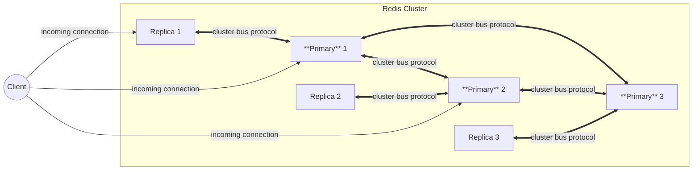

> [!NOTE]
>
> This article contents haven't been verified by running redis nodes. Please read official documents to verify the correctness of this document.

## tl; dr

This is about a gist of this article.

- Redis cluster is multi-primary, multi-replicas cluster.
- A replica can be used
    - to promote a primary node if one primary node is disconnected
    - receive a query on a replica if a client sends a **READONLY** command
- a cluster redirects a client to access a correct node by replying **MOVED** command (permanent) or **ASK** (only once) if a request comes to an incorrect node from a client
- **cluster_node_timeout** is used to identify if a node is faulty state or not, and run failover
    - And none of primary and replica nodes for a hash slot isn't available, cluster doesn't allow write queries anymore.

## Redis cluster 101

I've used a Redis as a cache in the past, but I've never learned how to operate a Redis, especially in a scale.
In a large scaled DB system, there are a few things to be taken into account

- Redis provides a cluster, but how does a Redis cluster work?
- How to load balance a traffic? How does a client find a right node? How does a read query go to?
- How to failover a primary host when a node fails?
- How to replicate data from a primary to a replica?

There are also other things need to be taken into account if Redis is used not only cache.
But in this article, I investigated to answer the above of these questions.
Most of my investigation is from the next 2 pages on the official document, so to learn more, take a look at them.

- [Redis: Scale with Redis Cluster](https://redis.io/docs/latest/operate/oss_and_stack/management/scaling/)
- [Redis cluster specification](https://redis.io/docs/latest/operate/oss_and_stack/reference/cluster-spec/)

### How a Redis cluster works?

A redis cluster consists of at least 3 primary hosts, so it's a multi-write cluster.
Multiple replicas can be added on each primary node.
Next diagram is a rough diagram to show a communication of a client and a redis cluster.

By the way, I couldn't figure out how a replica communicates, so a replica might communicate with other primary nodes from which it doesn't replica.

#### Protocol

A client communicates to a redis cluster by `6379` port by default.
Among nodes, a cluster protocol called **Redis Cluster Bus** is used, and the default port number is 10,000 bigger than the client port.
There is official document for the protocol as it's clearly for an internal purpose according to the cluster spec.

#### How to split data

In a cluster, there are multiple write nodes, so the data must be split among write nodes.
In a Redis cluster, the data is split based on **hash slots**, and a certain key or **hash tags** used to calculate a hash and the same key always goes to the same node.
Hash tags include `{*}` in a key, for example, `user:{123}:profile`, to calculate and put the same keys into the same node.

#### Replication

Replication between a primary and replica node is asynchronous as default.
And even when a synchronous replication is used, it doesn't guarantee strong consistency.

### Load balancing traffic

Because there are multiple write nodes, a client needs to find a correct node to write the data.
One way is to use a proxy and the proxy handles a request to find the right write node, but a redis cluster doesn't follow this way.

Instead, a node replies to a **redirect** command if a client sends a request to an incorrect node.
Then a client can connect to a correct node by the next command.

There are 2 ways for redirection on a redis cluster.

- `MOVED`: this is used if the data is in a different node and a client is supposed to cache this key for the node. In this case, a node is supposed to be the result permanently.
- `ACK`: this is used only if the next command needs to redirect. This happens when a hash slot is migrated.

#### Read queries to a replica

When a client sends a `READONLY` command, a query goes to a replica instead of a primary node.
By this, a read throughput can be scaled for a cluster.

### Failover

When a node fails due to various reason, a failover runs.
It's detected by a heartbeat which is ping/pong packets between nodes.
If a node doesn't reply within **node timeout** time, which is configured by `cluster-node-timeout`, a node is identified as a failure and failover starts.
Failover runs when a primary node is down and

- one of replicas is promoted as long as a replica is within the acceptable disconnected time from its primary node.
    - Its' calculated by `cluster-slave-validity-factor * node timeout`
- a cluster becomes unavailable when a no replica can be promoted.

I didn't figure out what happens when a replica fails, but I think it's not a big problem.

When a cluster fails, the behavior depends on `cluster-require-full-coverage` and `cluster-allow-reads-when-down` variables.
As default,

- A cluster stops accepting any write and read queries.

For recovery, if a `cluster-slave-validaity-factor` > 0 , the original primary node needs to rejoin to recover.
If a cluster fails to failover, I couldn't find how to handle the situation in the official doc, but in the [stackoverflow](https://stackoverflow.com/questions/47029025/how-to-fix-the-redis-cluster-state-after-a-master-and-all-its-slaves-are-down), it is described in a few ways

- Use `redis-cli --cluster fix $ONE_OF_HEALTHY_NODE_IP:$PORT --cluster-fix-with-unreachable-masters` command
- Set `cluster-require-full-coverage` to no, or
- Recreate all nodes.

## (WIP) Use a redis cluster

So far, it's a theory I learned from official documents.
So, let's verify and observe behaviors described the above.

In order to run a redis cluster, I used Docker Compose and use a some container images.

- [Redis container image](https://hub.docker.com/_/redis/)
- [Redis insight](https://redis.io/insight/)
    - **Redis Insight** is a GUI to manage Redis easily

To set up a redis cluster, I read next 2 articles and

- [Redis: 4.1 Exercise - Creating a Redis Cluster
](https://redis.io/learn/operate/redis-at-scale/scalability/exercise-1)
- [Medium: Deploying a Redis Stack Cluster using Docker images along with RedisInsight
](https://medium.com/@joshisoftynakul/deploying-a-redis-stack-cluster-using-docker-images-along-with-redisinsight-e3588f038a40)

### Configurations

Set up containers by Docker Compose.
Note that in order to access a redis cluster, it has to connect from a container's network. Otherwise, redirection by **MOVED** command doesn't work properly.

docker-compose.yml


networks:
  redis:
    driver: bridge

services:
  redis-insight:
    # https://redis.io/docs/latest/operate/redisinsight/install/install-on-docker/
    image: redis/redisinsight:latest
    ports:
      - 5540:5540
    networks:
      - redis
    volumes:
      - redisinsight_data:/data

  redis-node-1: &redis-node
    image: redis
    networks:
      - redis
    command:
      - redis-server
      - /etc/redis.conf
    volumes:
      - ./redis.conf:/etc/redis.conf
    healthcheck:
      test: ["CMD", "redis-cli", "ping"]
      interval: 1s
      timeout: 3s
      retries: 5

  redis-node-2: *redis-node
  redis-node-3: *redis-node
  redis-node-4: *redis-node
  redis-node-5: *redis-node
  redis-node-6: *redis-node

  # redis cluster requires at least 3 primary nodes
  # --cluster-replicas=1 means one replica for each primary node
  init:
    image: redis
    command:
      - redis-cli
      - --cluster
      - create
      - redis-node-1:6379
      - redis-node-2:6379
      - redis-node-3:6379
      - redis-node-4:6379
      - redis-node-5:6379
      - redis-node-6:6379
      - --cluster-replicas
      - "1"
      - --cluster-yes
    depends_on:
      - redis-node-1
      - redis-node-2
      - redis-node-3
      - redis-node-4
      - redis-node-5
      - redis-node-6
    networks:
      - redis

volumes:
  redisinsight_data:
    driver: local


redis.conf

<pre>
cluster-enabled yes
cluster-config-file nodes.conf
cluster-node-timeout 5000
appendonly yes
</pre>

Note that `cluster-config-file` is a path to a `state` file which is used internally by a cluster.

Once these containers start, Redis Insight can be connected by `localhost:5540`.

> **TODO**: Redirection, resharding, and failover should be tested

## Reference

Apart from the official documents I shared above, there are also other articles or videos to learn a Redis cluster you can learn.

- [YouTube: HelloInterview's Redis Deep Dive w/ a Ex-Meta Senior Manager](https://www.youtube.com/watch?v=fmT5nlEkl3U&t=50s)
