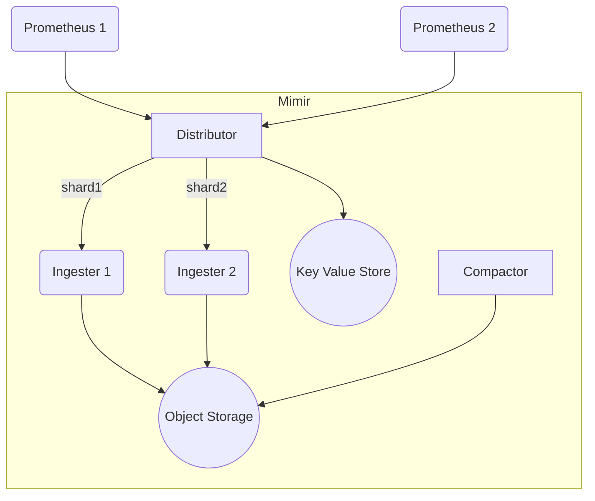
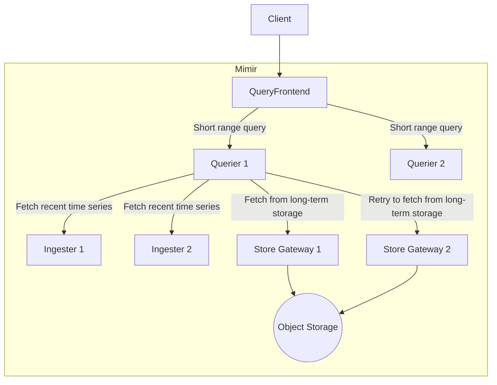

Grafana Mimir is a multi tenant, horizontal scalable, long-term storages for Prometheus.
In this article, I collect some information to understand how Mimir works to understand it's benefit.

There are some articles that you can read which might be more benefit.

- [Mimir benefit](https://blog.palark.com/prometheus-centralized-storage-mimir/)

## Architecture

The detailed architecture of an ingestion pipeline.

A few features are supported by Grafana Mimir.

- [Out of order samples ingestion](https://grafana.com/docs/mimir/latest/configure/configure-out-of-order-samples-ingestion/) is an experimental feature.
- Ingesters are split by sharding and replication

There are a few things keep in mind on the above diagram, however;

- I have no idea about how replication of ingesters works, and it isn't described in the above diagram.
- In February 2025, [WarpStream](https://grafana.com/blog/2025/02/20/the-next-generation-of-grafana-mimir-inside-mimirs-redesigned-architecture-for-increased-reliability/?ref=dailydev) can also be used for scalability for ingestion
- Rhere is no downsampling supported and a proposal is discussed in [an open PR](https://github.com/grafana/mimir/pull/5028).

On the other hand, the architecture of a query pipeline is following:

## Distributor

The distributor is a stateless component to receive time series data outside of Grafana Mimir.
The main features are

- validation
- rate limiting
    - this is local rate limiting per-distributor
- HA deduplication
    - Deduplication is based on `external_labels`
    - Use Key Value Store for HA tracker, which is either consul or etcd.
- Sharding and replication toward ingesters
    - Shard key is based on a [hash ring](https://grafana.com/docs/mimir/latest/references/architecture/hash-ring/), which is a hash value calculated from all label values and tenant ID of time series.
    - Send time series to multiple ingesters based on a sharding and replication configuration

For more details about features, see [this page](https://grafana.com/docs/mimir/latest/references/architecture/components/distributor/).

## Ingester

Ingester is a stateful component to upload time series into a long-term storage.
Ingester also stores the latest data until it uploads time series into a long-term storage,

The main features are

- Compression for time series
- Batch uploads for time series to an object store
    - By default, every 2 hours
- [Shuffle sharding](https://aws.amazon.com/builders-library/workload-isolation-using-shuffle-sharding/)
    - This provides a single-tenant experience for multi-tenants workloads
    - This causes unbalanced resource utilization multiple instances
    - There is a few limitations, for instance, unable to safely decreasing the tenant shard size for read requests

Also, Ingester holds time series in-memory, but it may cause to loss data.
For resiliency for data loss, there are 3 options:
- Replication
    - Writes to the Mimir cluster are successful if a majority of ingesters received the data. With the default replication factor of 3, this means 2 out of 3 writes to ingesters must succeed
    - There is an option for zone-aware replication to ensure time series across multiple zones.
- Write Ahead Log (WAL)
    - Store time series into a persistent disk
    - Somehow, replication is still recommended in order to gracefully handle a single ingester failure.
- Write Behind Log
    - Resiliency for Data Loss for out-of-order ingestion
    - Similar to WAL

For more details, see [this page](https://grafana.com/docs/mimir/latest/references/architecture/components/ingester/).

## Compactor

A compactor is a stateless component to increase a query performance and reduces long-term storage usages by combining blocks.

The few features

- Deduplicate chunks and reduces the size of an index
- Delete blocks based on the configured retention period

## Query Frontend

This is a stateless component with the same API as querier.

- Split queries
    - Split by a long-range queries into multiple queries and send downstream queriers into parallel.
        - A query is split based on split interval, and by default, it's 24 hours.
    - Split queries by a shard. Query sharding is described in [this page](https://grafana.com/docs/mimir/latest/references/architecture/query-sharding/)
- Cache queries, and if cache data is partially missnig, calculates the required partial queries
- Queueing for retrying failed queries and scheduling queries among multiple tenants

However, unless using query-scheduler component, there is a scalability limitation.

## Querier

This is a stateless component.
This fetches metadata for the metadata of blocks in a long-term storage via store gateway, and use them to send subsequent queries.
This can also send queries to ingesters if query time range is recent enough not to store the data in a long-term storage.

The metadata can be cached and Memcached can be used.

## Store Gateway

This is a stateful component to query blocks from a long-term storage.

- Replicate blocks across the pool of the same shard
    - Zone-aware replication is supported
- Shuffle sharding is supported
- Cache index, chunks, and metadata

## Key Value Store

Key Value Store is used for a few features.

- HA Tracker (Distributor)
- Hash ring

Current options for key value stores are either Consul or etcd

## Long-term storage

Long-term storage

- Stores time series in 2 hours block
- Storages are either an object storage such as AWS S3, or local storage for a monolithic deployment

## And more

In this article, I haven't written the details for

1. How does replication of an ingestor works?
2. How do AlertManager, Ruler, and Query-scheduler components work
